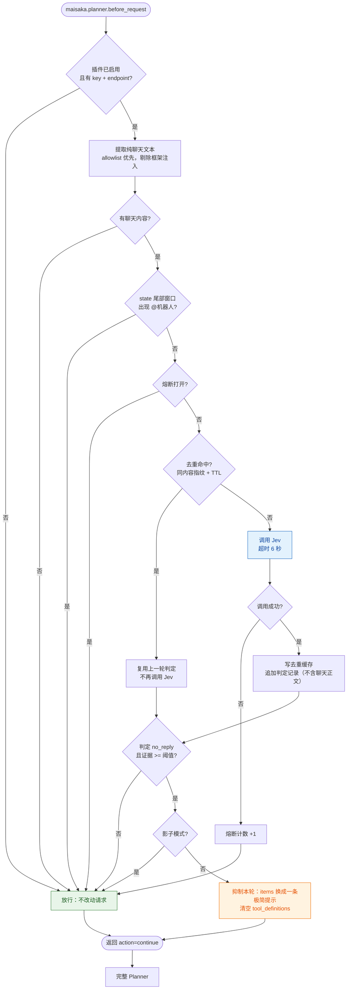

# Jev 参与门控（jev timing gate）

[](./LICENSE)
[](./_manifest.json)
[](https://github.com/krijingle-create/maibot-jev-timing-gate)

在 planner 请求发出之前，用决策模型 [Jev](https://typesafe.ai) 判断一次：**这一轮群里的新消息，值不值得花一次完整的 planner？**

Jev 返回带校准置信度的结构化答案（Choice / Score / Noul 三种原语，不生成文本）。判定「本轮无需参与」且证据足够时，
插件把这一轮的 `items` 改写成一条极简提示、并清空工具定义；拿不准、端点故障、被 @ 时一律放行。
**宁可多花一次，也不让机器人该说时不说。**

两个前提先说清楚，免得期待错位：**开销与收益量级接近，不是净赚**；判定会把真实群聊文本发往你配置的端点（见「边界与注意事项」）。

---

## 运行流程



结论只有两条，**所有失败路径都归到第一条**：

| 结论 | 触发条件 | 对请求的影响 |
|---|---|---|
| **放行** | 未启用 · 无凭据 · 拿不到昵称 · 无聊天内容 · 被 @ · 熔断中 · 调用失败 · 证据不足 · 影子模式 | 不改动，正常进入 Planner |
| **抑制** | `no_reply` 且 `p(no_reply) >= probability_threshold`（默认 0.80） | `items` 换一条「本轮无需参与」提示；`tool_definitions` 清空 |

三个内置保护：

- **每轮去重**：同一内容指纹在 TTL 内只判定一次，避免 hook 多次触发导致重复付费。
- **熔断器**：端点连续失败 5 次进入 300 秒冷却，冷却期内不发请求、直接放行。
- **昵称守门**：读不到机器人昵称就**拒绝启用**——避免「被点名时被静默抑制」这种不可见的坏结果。

---

## 快速开始

把插件放进 `MaiBot/plugins/`，目录名用 `bg4jts_jev-timing-gate`（与 manifest 的 id `bg4jts.jev-timing-gate` 对应）。
在 MaiBot 根目录下执行：

```bash
# git clone：之后可以直接 git pull 更新
git clone https://github.com/BG4JTS/maibot-jev-timing-gate.git plugins/bg4jts_jev-timing-gate

# 或者下载 ZIP：仓库页 Download ZIP，解压后把 maibot-jev-timing-gate-main
# 改名成 bg4jts_jev-timing-gate，整个目录放进 plugins/
```

1. 首次加载后，Runner 依据 `config.py` 的 `config_model` 自动生成 `config.toml` 并在 WebUI 插件设置页渲染；`config.example.toml` 只是带注释的参考。
2. 在设置页选一个模型提供商模板（见下表），填上 `api_key`。`endpoint` 留空即用该模板的默认地址。
3. 想先观察，就把 `shadow_mode` 打开：只记录「本该抑制」，不改行为。

更新：

```bash
cd plugins/bg4jts_jev-timing-gate && git pull
```

WebUI 插件页的更新按钮两条路径都认：目录里有 `.git` 就 `git pull`，没有就按 manifest 的仓库地址重新克隆。
两者都会保留你填好的 `config.toml`；用 `jev_config.json` 存 key 的话只有前一条会连它一起保住，走重新克隆前记得先备份。

### 模型提供商模板

| 模板 | `endpoint` | `api_key` | 备注 |
|---|---|---|---|
| `typesafe`（默认） | 留空即官方直连地址 | 必填 | TypeSafe 官方端点；其它 TypeSafe 兼容网关可填自己的完整 URL |
| `classifier_dev` | 留空即默认地址 | 不用填 | 免费转发站；文本会经该站转发给 TypeSafe |
| `openai_json` | 必填（如 `https://host/v1/chat/completions`） | 按需 | 任意 OpenAI 兼容网关，要求模型严格回 `{"choice":..., "confidence":...}` |

鉴权默认按模板走，一般是 `Authorization: Bearer <key>`。要对接自定义鉴权的网关，用「鉴权头名」和「鉴权前缀」覆盖：
两者都能填 `none` 表示不发送该部分。例如头名填 `x-api-key`、前缀填 `none`，就是直接放裸 key。

实测（2026-09-22）：同一批样本下 `classifier_dev` 与 `typesafe` 判断方向一致。别人家 bot 的指令刷屏判 `no_reply`，直接点名机器人判 `continue`。

---

## 配置速查

```toml
[plugin]
enabled = true           # 总开关。默认开：模板 + key 填好即生效
shadow_mode = false      # true = 只记录"本该抑制"，不改行为
api_style = "typesafe"   # typesafe / classifier_dev / openai_json（设置页里是下拉）
endpoint = ""            # 留空按模板取默认；openai_json 必填
auth_header = ""         # 留空按模板取默认；"none" = 不发鉴权头
auth_prefix = ""         # 留空按模板取默认；"none" = 不带前缀直传 key
api_key = ""             # 填这里即可；也可放 data/plugins/<plugin_id>/jev_config.json（600 权限）隐藏密钥；旧插件目录同名文件仍兼容
model = "jev-latest"     # 实测 jev-1.13.0 也可用；jev-fast / jev 会返回 400
timeout_sec = 6.0        # 超时即放行；必须小于 hook 超时 8 秒
state_max_chars = 3000   # 判定用的聊天文本上限（取最新内容）

[gate]
enabled = true
probability_threshold = 0.8           # probabilities["no_reply"] ≥ 该值才抑制
confidence_fallback_threshold = 0.62  # 端点没返回 probabilities 时的回退阈值
bot_aliases = []                      # 留空 = 自动读 bot.nickname（推荐）
mention_window_chars = 600            # @提及的扫描窗口（只看最新内容）
```

密钥位置：**优先** `data/plugins/<plugin_id>/jev_config.json`（宿主规范数据目录）；旧版放在插件源码目录的同名文件仍兼容读取，命中时打印一次迁移提示。

---

## 怎么确认它在工作

```bash
grep -a 'Jev 门控' logs/nohup.log | tail -20
```

会看到这几类行，对应不同分支：

```
Jev 门控：检测到 @机器人，跳过门控，正常进入 Planner          ← 豁免，不调用 Jev
Jev 门控：continue (conf=0.44 p_no_reply=0.28)，正常进入 Planner
Jev 门控：no_reply 但证据不足 (p_no_reply=0.61 < 0.80 …)   ← 拿不准就放行
Jev 门控[复用]：复用本轮判定，不重复调用 Jev                    ← 同一轮只判定一次
Jev 门控：判定端点连续失败已熔断，冷却剩余 300 秒…              ← 熔断中，不发请求
Jev 门控：判定无需参与(p_no_reply=0.95 >= 0.80 …)，本轮已改写成极简请求
```

影子模式下最后一行变成 `Jev 门控[影子]：本该抑制（…），本轮不改行为`。

插件还会把每次判定追加到 `data/plugins/<plugin_id>/gate_decisions.jsonl`（JSONL，**不含聊天正文**），并在 WebUI 首页渲染成效卡片：累计判定、抑制率、去重复用、熔断状态，以及宿主 token 趋势的**背景参考**（宿主级聚合，无本插件归属）。

---

## 开销与收益

下面的量级来自本插件在 MaiBot 1.2.5 上的实测，仅供参考：

- 一个完整 planner 轮次的 prompt 通常几千 token（6k 量级）；被改写的轮次只剩几十 token：
  只发一条「本轮无需参与」提示，不带选中的历史消息，也不带工具定义。
- 抑制率取决于群里的噪声轮次占比，实测大约在 1/4 到 1/3。
- Jev 每次判定约 1 到 2k token，与送去的文本长度成正比。

开销和收益量级接近，近似打平。实际影响主要在两处：

1. 明确的噪声轮次（别的 bot 的指令刷屏、纯灌水）不再走完整规划；
2. 抑制会推进 MaiBot 原生的空闲退避：连续空闲触发指数退避（15 秒起、最多 300 秒），退避窗口内的新消息不触发 planner。

这些数字不能直接套到你的实例；想看清自己这儿的量级，先把 `shadow_mode` 设成 `true` 只做观察，再按日志与 `gate_decisions.jsonl` 估算。

---

## 边界与注意事项

- **需要 Maisaka 架构**（`src/maisaka/`），也就是 dev / main / neo-mai 分支；`classical` 老架构没有这些 hook，装不上。
- **不要和同类门控同时开**。若你另外装了内置 Jev 门控的插件，两者同时启用会让每轮调用两次 Jev、两套抑制逻辑同时生效，请二选一。
- **隐私**：判断会把真实群聊文本发送到你配置的端点。实测把昵称和群名片匿名化后判断会明显跑偏——`@昵称` 换成 `@我` 后，被点名的消息反而被判成不用回，置信度 0.84。因此插件按原样发送文本。如果群里的人在意隐私，请不要启用。本地只持久化判断结果（动作 / choice / 置信度 / 概率），不落聊天正文。
- **抑制轮不是零成本**：它仍要发一次模型请求，只是内容被压成一条提示，几十 token。
- **不生成文本**：Jev 只做判断，不能替 planner 或 replyer 写任何东西。
- **任何失败都走放行**：网络错误、超时、返回结构异常、配置读不到、拿不到昵称，一律正常进入 Planner，不会让门控把机器人变成哑巴。

---

## 文件说明

| 文件 | 作用 |
|---|---|
| `plugin.py` | 插件主体：hook 注册、去重与熔断接线、Jev 调用、判定记录、首页卡片 |
| `gate_core.py` | 纯逻辑层（状态提取 / @豁免窗口 / 判定 / 去重 / 熔断 / 多提供商适配），不依赖 SDK，可离线单测 |
| `config.py` / `config.example.toml` | 配置模型（含设置页标签与下拉）与带注释的参考 |
| `tests/test_gate_core.py` | 纯逻辑离线用例（不依赖 SDK、不联网） |
| `tests/test_plugin_gate.py` | 插件接线离线集成用例：桩掉 SDK，驱动真实的 `_maybe_gate` |
| `LICENSE` | 许可证（MIT） |

```bash
python tests/test_gate_core.py      # 纯逻辑
python tests/test_plugin_gate.py    # 插件接线（用桩驱动真实的 _maybe_gate）
```

---

## 来源与致谢

本仓库是 **krijingle-create** 的 [`maibot-jev-timing-gate`](https://github.com/krijingle-create/maibot-jev-timing-gate)
的衍生仓库（fork），由 **BG4JTS** 独立维护：

- 上游仓库：<https://github.com/krijingle-create/maibot-jev-timing-gate>（原作者：krijingle-create）
- 本仓库：<https://github.com/BG4JTS/maibot-jev-timing-gate>
- 授权：MIT。`LICENSE` 保留上游版权行 `Copyright (c) 2026 krijingle-create`，并在其下追加本仓库的版权行。
- 本仓库**永久独立、不跟踪上游**（不配置 `upstream` remote），因此 `gate_core.py` 与上游必然逐步分叉；
  `gate_core.py` 自 v1.1.0 起由本仓库手写维护，不再是「由仓库外生成器产出的生成物」。

相对上游的主要修改：

1. `gate_core.py` 状态提取改为 **allowlist 优先**：聊天消息 Item 整条保留，未标记 Item 回退到排除清单。
2. 新增**每轮去重**：同一内容指纹在时限内只判定一次，避免 `planner.before_request` 多次触发导致重复付费。
3. 新增**熔断器**：端点连续失败达阈值后进入冷却，冷却期内不发起网络请求、直接放行。
4. 密钥默认位置迁到宿主规范目录 `ctx.paths.data_dir`；旧的插件目录同名文件仍兼容读取并一次性告警。
5. 配置读取改用文档化的 `ctx.config.get`；插件身份改为 `bg4jts.jev-timing-gate` / `1.1.0`。
6. 新增**判定记录持久化**（JSONL，**不含聊天正文**）、WebUI **首页成效卡片**，以及宿主 token 趋势的背景展示。

上游项目自己的发布流水线与本仓库无关；本仓库的维护说明见 `PUBLISHING.md`。
